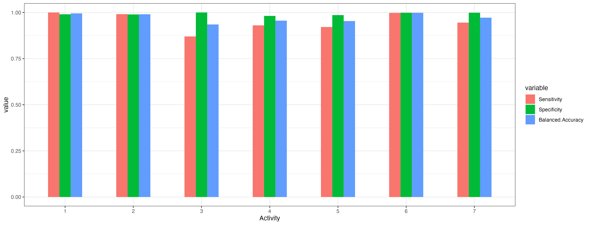

# BIOS626_Midterm

### UID: mm0507
### Final Binary Accuracy: 1.0
### Final Multiclass Accuracy: 0.959

## Project Description 
### Objective

For this project, we will built classifiers to predict participants' activities using the motion signals captured by their smartwatches. The activities include three static postures (standing, sitting, lying), three dynamic activities (walking, walking downstairs, and walking upstairs), and postural transitions that occurred between the static postures. There are two tasks: 

1. Build a binary classifier to classify the activity of each time window into static (0) and dynamic (1). For this task, consider postural transitions as static (0). 
2. Build a refined multi-class classifier to classify walking (1), walking_upstairs (2), walking_downstairs (3), sitting (4), standing (5), lying (6), and static postural transition (7)

### Dataset Description

| Variables               | Training     | Testing |
|-------------------------|--------------|---------|
| No. Observations        | 7767         | 3162    |
|No. Participants       | 21           | 9       |
| No. Variables           | 563          | 562     |
| **Activities Distribution** |              |         |
|    1 WALKING            | 1226 (15.8%) |         |
|    2 WALKING_UPSTAIRS   | 1073 (13.8%) |         |
|    3 WALKING_DOWNSTAIRS | 987 (12.7%)  |         |
|    4 SITTING            | 1293 (16.6%) |         |
|    5 STANDING           | 1423 (18.3%) |         |
|     6 LYING             | 1413 (18.2%) |         |
|    7 STAND_TO_SIT       | 47 (0.6%)    |         |
|    8 SIT_TO_STAND       | 23 (0.3%)    |         |
|    9 SIT_TO_LIE         | 75 (1.0%)    |         |
|   10 LIE_TO_SIT         | 60 (0.8%)    |         |
|   11 STAND_TO_LIE       | 90 (1.2%)    |         |
|         12 LIE_TO_STAND | 57 (0.7%)    |         |

There are 21 participants in the training data and 9 in the testing data. We note that the participants in the training set do not appear in the testing set. Each participants have multiple observations of their movement trajectories during the experiment. The majority of the activites are either static or dynamic activities and only a small portion is the postural transitions (< 5%). 

## Train Test Split and Cross Validation

To avoid overfitting, we split the training data into two: training and validation. Because we want to model to perform well for predicting the activities of completely unknown individuals, we split the training data by ID: those with ID less than 23 were placed in the training set and the rest are in validation. We also tuned the hyperparameters of models using out-of-bag samples and cross validation. Addtional details will be provided in the section below. 

## Binary Classification 

### Baseline Algorithm 

For the baseline algorithm, we used a generalized linear model (GLM) with the binary activity as the outcome and all the motion capture variables as the predictors. We did not conduct any variable pre-processing because we want to evaluate the baseline before any additional data pre-processing. We trained the data on the training set and evaluate the results using the validation set. The confusion matrix of the validation data is shown below. 

|               | Reference = 0 | Reference = 1 |
|---------------|---------------|---------------|
| **Predicted = 0** | 1399          | 4             |
| **Predicted = 1** | 0             | 1002          |

As we observe the simple GLM method performed exceptionally well. The overall accuracy is 0.99 with sensitivity 1 and specificity 0.99. This results shows that the model is effective in predicting the static and dynamic acticity apart. 

### Final Algorithm 

Although the GLM model demonstrated good performance, we wanted to experiment with other models that might (1) conduct implicit variable selection (2) consider complex variable interactions. Since the motion sensor data is high dimentional and complex, it is unlikely for us to consider all possible variable transformations and interactions. We decided to use train an artificial neural network model. For the neural network, we use the keras and tensorflow package in python.

We specify the neural network model to include two layers, both with relu activiation function. The output layer will use sigmoid activiation fuction to ouput a probability between 0 and 1. We also specify the optimizer to be adam and the loss is binary_crossentropy. We will use accuracy as the metric for optimizing the model because the two classes are balanced. We traied 100 epochs but we noticed the loss becomes negligible after 10 epoches. The results on the validation set is shown below. 

|               | Reference = 0 | Reference = 1 |
|---------------|---------------|---------------|
| **Predicted = 0** | 1399          | 0             |
| **Predicted = 1** | 0             | 1006          |

From the confusion matrix, we observe that the neural network can perfectly predict the binary outcome. We used the trained model to predict the outcome for the hold-out test set and the final accuracy is 1. 

### Challenges

Initially, the leaderboard performance of the binary classifier was very poor (0.50 in the first submission), despite the high accuracy demonstrated in the validation (> 0.99). We were not able to identify the issue until we finally figured out that the outcome definition was incorrect. Previously, we only classified the postural transitions as 1 and the rest as 0. The definition mistake caused the classifier to be trained inapproriately, leading to sub-par performance in the hold-out test set. 

## Multi-class Classification 

### Baseline Algorithm 

We used XGBoost for the baseline algorithm. We used 3-fold cross validation to tune a range of hyperparameters including gamma, subsample proportion and maximum deepth. Each hyperparameter is randomly sampled from their corresponding distribution (random search) and then evaluated on the out-of-bag (OOB) sample and the validation set. We ran the algorithm 100 times and the following table prints a subset of hyperparameter tuning results. Notice the algorithm performs better on the OOB set compared to the validation set, which contains individuals that are not included in the training process. After the random search is complete, we use these hyperparameters and train a XGBoost model on the entire training data. We use the model to predict the hold-out test set. When submitted to the leaderboard, this algorithm didnot perform okay and only achieved a 0.945 accuracy on the testing set. This has led us to believe that perhaps the tuning leds to overfitting issues.

| max_depth | eta  | gamma | subsample | colsample_bytree | min_child_weight | max_delta_step | Accuracy_OOB | Accuracy_Validation |
| --------- | ---- | ----- | --------- | ---------------- | ---------------- | -------------- | ------------ | ------------------- |
| 6         | 0.24 | 0.06  | 0.63      | 0.53             | 17               | 10             | 0.98         | 0.92                |
| 8         | 0.08 | 0.14  | 0.71      | 0.62             | 8                | 10             | 0.98         | 0.92                |
| 6         | 0.26 | 0.1   | 0.87      | 0.75             | 39               | 10             | 0.98         | 0.92                |
| 6         | 0.08 | 0.06  | 0.89      | 0.58             | 37               | 7              | 0.97         | 0.92                |
| 8         | 0.3  | 0.16  | 0.87      | 0.73             | 26               | 2              | 0.98         | 0.92                |
| 8         | 0.3  | 0.07  | 0.71      | 0.62             | 5                | 6              | 0.99         | 0.93                |
| 8         | 0.17 | 0.12  | 0.66      | 0.77             | 23               | 6              | 0.98         | 0.93                |
| 7         | 0.03 | 0.08  | 0.83      | 0.79             | 32               | 2              | 0.96         | 0.9                 |
| 10        | 0.22 | 0.15  | 0.74      | 0.56             | 16               | 9              | 0.98         | 0.93                |
| 6         | 0.19 | 0.1   | 0.73      | 0.68             | 2                | 2              | 0.99         | 0.93                |

We find the optimal combination to be:

| max_depth | eta  | gamma | subsample | colsample_bytree | min_child_weight | max_delta_step |
| --------- | ---- | ----- | --------- | ---------------- | ---------------- | -------------- |
| 7         | 0.24 | 0.2  | 0.89      | 0.51             | 26               | 2             |

### Final Algorithm 

The algorithm that achieved the best performance (0.959) is a SVM model with linear kernel. For this model, we did not perform any additional hyperparameter tuning. The overall accuracy on the testing set was 0.953. The tuning parameter C was set to 1. Next, we check the performance by activity. We found that the performance for activity 3 and 4 are slightly worse compared to other activities. 

## Leaderboard Performance

## Conclusion & Future Work
